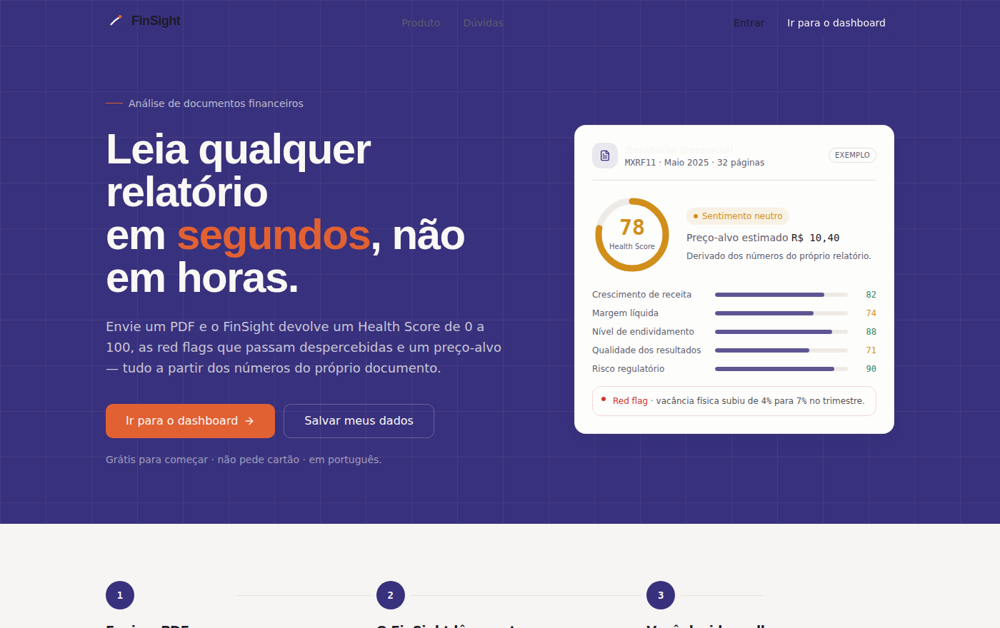
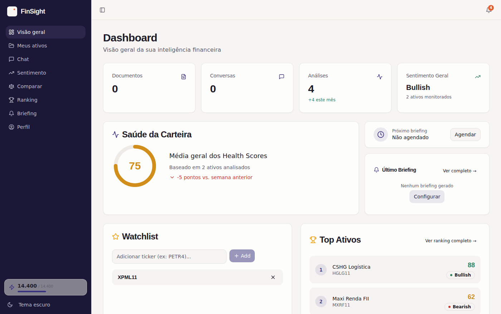
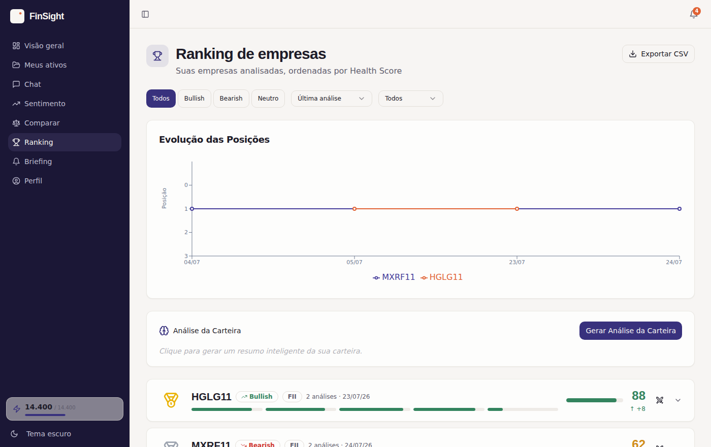
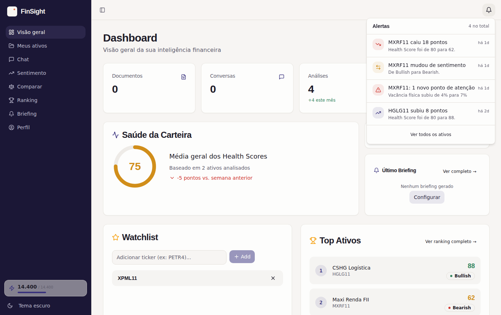
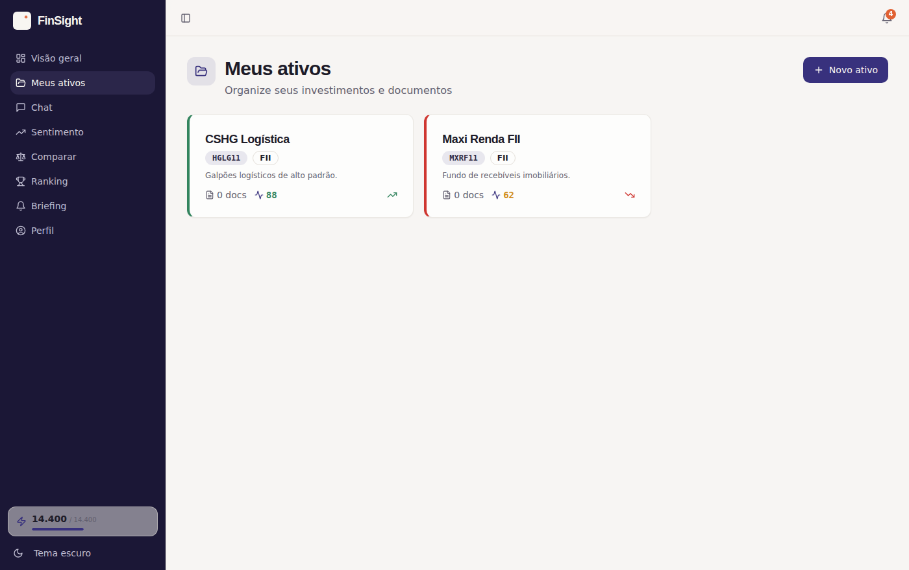
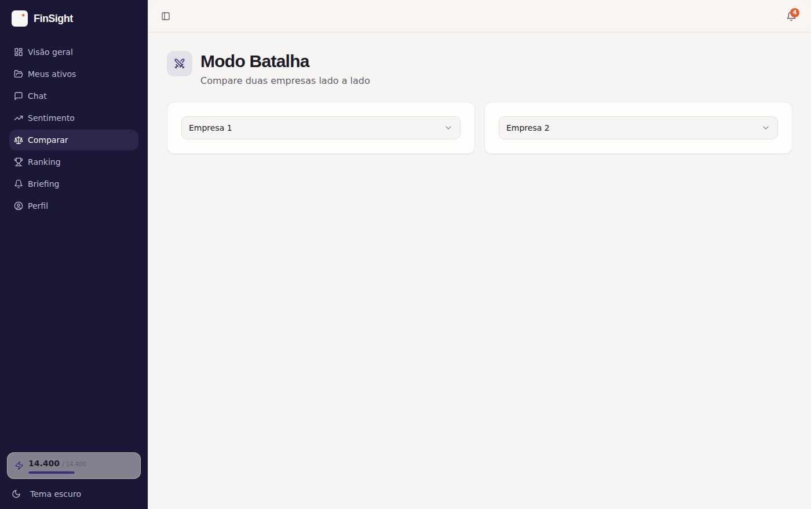
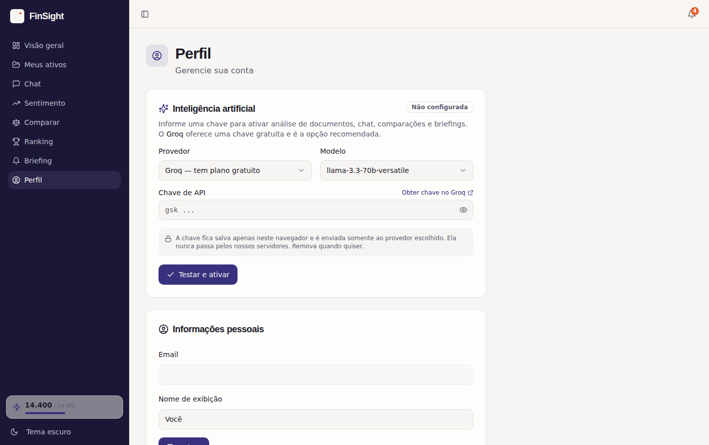

# FinSight

**Leia qualquer relatório financeiro em segundos, não em horas.**

Envie um PDF — relatório de FII, 10-K, release de resultados ou informe CVM — e o FinSight
devolve um **Health Score de 0 a 100** com cinco subcategorias, os **pontos de atenção**
que passam despercebidos, um **preço-alvo estimado** e a leitura de **sentimento**. Depois,
converse com os documentos, compare ativos lado a lado, ordene a carteira por qualidade e
receba um briefing diário.

### ▶️ Acesse: **https://henry842.github.io/creative-flourish-hub/**



---

## Sumário

- [O que é](#o-que-é)
- [Demonstração](#demonstração)
- [Funcionalidades](#funcionalidades)
- [Como a inteligência artificial funciona](#como-a-inteligência-artificial-funciona)
- [Modo local: o app funciona sem backend](#modo-local-o-app-funciona-sem-backend)
- [Arquitetura](#arquitetura)
- [Rodando localmente](#rodando-localmente)
- [Deploy](#deploy)
- [Limitações conhecidas](#limitações-conhecidas)
- [Aviso importante](#aviso-importante)

---

## O que é

Investidores gastam horas lendo relatórios de 50 páginas e, mesmo assim, perdem detalhes
críticos. O FinSight transforma esse documento em uma **leitura graduada e navegável** em
segundos: um score, os riscos, a tendência e um chat que responde com a página de origem.

É um produto para o investidor pessoa física e semi-profissional brasileiro — em português,
sem jargão desnecessário e sem prometer o que não pode entregar.

---

## Demonstração

**Visão geral da carteira** — Health Score médio, watchlist, top ativos e a evolução ao longo do tempo.



**Ranking** — todos os ativos analisados ordenados por qualidade, com variação e evolução de posições.



**Alertas automáticos** — quedas de score, viradas de sentimento e novos pontos de atenção, detectados sozinhos.



**Meus ativos** — cada investimento com seus documentos, análises e conversas em um só lugar.



**Modo Batalha** — dois ou três ativos comparados métrica a métrica, com gráfico radar e veredito.



**Ativação da IA** — o usuário informa uma chave (o Groq tem plano gratuito) e tudo passa a funcionar.



---

## Funcionalidades

| Recurso | O que faz |
|---|---|
| **Análise de documentos** | Health Score 0–100 com cinco subcategorias, pontos de atenção, preço-alvo, sentimento e linha do tempo — sempre a partir dos números do próprio relatório. |
| **Chat sobre documentos** | Perguntas em português com contexto cruzado entre vários arquivos e citação da página de origem. |
| **Modo Batalha** | Comparação de 2–3 ativos métrica a métrica, gráfico radar, veredito e histórico salvo. |
| **Ranking** | Carteira ordenada por Health Score, com variação, filtros por sentimento/tipo e evolução de posições. |
| **Sentimento** | Distribuição e tendência de sentimento das análises ao longo do tempo. |
| **Briefing diário** | Resumo da carteira com variações de score e pontos de atenção (com notícias reais quando o backend está publicado). |
| **Alertas automáticos** | Queda/alta de score, virada de sentimento, novos pontos de atenção e risco regulatório elevado. |
| **Relatórios em PDF** | Exportação com a identidade visual do produto — do ativo ou da comparação. |
| **Watchlist** | Tickers monitorados com o último score e sentimento. |
| **Temas claro e escuro** | Ambos tratados como first-class, não como enfeite. |

---

## Como a inteligência artificial funciona

O FinSight tenta **dois caminhos, nesta ordem** — o que dá segurança sem sacrificar o
funcionamento:

**1. Servidor (Supabase Edge Functions).** Quando publicadas, a chave fica no servidor e o
usuário final não configura nada. Segredos usados: `GROQ_API_KEY`, e opcionalmente
`NEWS_API_KEY` (notícias no briefing) e `OCR_API_KEY` / `OCR_GATEWAY_URL` (PDFs digitalizados).

**2. Chave do próprio usuário.** Se as funções não estiverem disponíveis, o app pede uma
chave em **Perfil → Inteligência artificial**. Ela fica salva **apenas neste navegador** e é
enviada somente ao provedor escolhido — nunca passa por servidores do projeto.

Provedores suportados (todos compatíveis com a API da OpenAI):

| Provedor | Observação |
|---|---|
| **Groq** | Recomendado. Possui plano gratuito. Modelos Llama 3.3 70B / 3.1 8B. |
| **OpenRouter** | Alternativa útil caso o navegador bloqueie o Groq por CORS. |
| **OpenAI** | Pago. |

Nesse modo, a **leitura do PDF acontece no próprio navegador** (`pdfjs`), então análise,
chat, comparação, ranking e briefing funcionam mesmo hospedado como site estático.

---

## Modo local: o app funciona sem backend

Se o Supabase estiver indisponível (projeto pausado, login anônimo desativado ou sem rede),
o app **não quebra e não fica vazio**: ele passa a servir os mesmos dados a partir do
navegador, via IndexedDB.

Isso é feito emulando o contrato HTTP do PostgREST e do Storage — filtros, ordenação,
limites, contagem, inserção, atualização e remoção — de forma que **nenhuma tela precisou
ser alterada**. Criar ativo, enviar PDF, analisar, comparar e exportar continuam
funcionando, e os dados persistem entre recarregamentos.

Na primeira abertura o modo local vem com um **conjunto de exemplo** (dois FIIs com
histórico de análises), para que o produto já possa ser demonstrado de imediato.

---

## Arquitetura

```
React 18 + TypeScript + Vite
├── Tailwind CSS + shadcn/ui (Radix)   interface e design system
├── TanStack Query · React Router      dados e navegação
├── Recharts                           gráficos
├── pdfjs-dist                         leitura de PDF no navegador
└── src/lib/
    ├── ai.ts          camada única de IA (servidor + chave do usuário, streaming)
    ├── analysis.ts    análise do documento (prompt, schema e gravações)
    ├── pdf.ts         extração de texto do PDF
    ├── alerts.ts      alertas derivados do histórico
    ├── briefing.ts    briefing diário
    ├── report.ts      relatórios em PDF
    └── localdb.ts     backend local (IndexedDB) quando não há sessão

Supabase  ·  Postgres com RLS · Auth · Storage · Edge Functions (Deno)
IA        ·  Groq / OpenRouter / OpenAI · OCR por visão computacional
```

As decisões de produto e do sistema visual estão documentadas em
[`PRODUCT.md`](./PRODUCT.md) e [`DESIGN.md`](./DESIGN.md).

---

## Rodando localmente

```bash
npm install
npm run dev        # http://localhost:8080
npm run build      # build de produção em dist/
npm run test       # testes unitários (Vitest)
npm run lint
```

Crie um `.env` na raiz com as chaves do seu projeto Supabase:

```
VITE_SUPABASE_URL="https://SEU-PROJETO.supabase.co"
VITE_SUPABASE_PUBLISHABLE_KEY="sua-anon-key"
VITE_SUPABASE_PROJECT_ID="seu-project-id"
```

> Sem essas variáveis o app ainda abre — ele entra automaticamente no modo local.

**Para persistência em nuvem**, habilite em *Authentication → Sign In → Anonymous sign-ins*
no painel do Supabase. **Para a IA no servidor**, publique as Edge Functions e defina
`GROQ_API_KEY` nos segredos.

---

## Deploy

O build é uma SPA estática (`dist/`) e roda em qualquer host. O workflow
`.github/workflows/deploy.yml` publica automaticamente no GitHub Pages a cada push na
`main`, incluindo o fallback de SPA (`404.html`). Para servir sob um sub-caminho, defina
`VITE_BASE_PATH` (ex.: `VITE_BASE_PATH=/creative-flourish-hub/`).

---

## Limitações conhecidas

Transparência sobre o que o projeto **não** faz hoje:

**Inteligência artificial**
- A chave informada em *Perfil* fica no `localStorage` do navegador. É o padrão "traga sua
  própria chave": conveniente, mas quem tiver acesso ao navegador consegue lê-la. Para uso
  comercial com vários usuários, o caminho seguro é publicar as Edge Functions e manter a
  chave no servidor.
- Chamar o Groq direto do navegador depende de o provedor permitir CORS. Se for bloqueado,
  basta trocar para **OpenRouter** no mesmo card — a interface já prevê isso.
- Modelos de linguagem erram. Os scores e resumos são **derivados** do documento, mas devem
  ser conferidos; o produto acelera a leitura, não substitui o julgamento.

**Documentos**
- PDFs **digitalizados** (imagem, sem camada de texto) não são lidos no navegador. O app
  detecta e orienta a colar o texto manualmente. O OCR automático (visão computacional) só
  funciona com as Edge Functions publicadas.
- Limite de 20 MB por arquivo.

**Modo local**
- Os dados ficam **apenas naquele navegador**: limpar os dados do site apaga tudo, e não há
  sincronização entre dispositivos. Para nuvem, use o Supabase com login anônimo habilitado.
- O conjunto de exemplo inicial é ilustrativo, não são dados reais de mercado.

**Backend e automação**
- As Edge Functions estão no repositório mas **não vêm publicadas**.
- O **briefing agendado** (`pg_cron`) só dispara sozinho com o backend publicado; no modo
  local a geração é manual.
- Os **alertas** são calculados quando o app é aberto. Não há push nem envio por e-mail.
- A exclusão de conta depende da Edge Function `delete-account`.

**Produto**
- Os planos e preços exibidos são ilustrativos: **não há cobrança nem gateway de pagamento**
  integrado.
- Não há colaboração multiusuário nem papéis de acesso.
- Interface disponível apenas em português (pt-BR).

---

## Aviso importante

O FinSight é uma **ferramenta de análise e organização de informação**. Ele não emite
recomendação de compra ou venda de ativos e não constitui consultoria de investimentos. As
decisões — e a responsabilidade por elas — continuam sendo de quem investe.

---

## Autor

**Henry Souza Santos**
[LinkedIn](https://linkedin.com/in/henry-souza-santos) · [GitHub](https://github.com/henry842)
